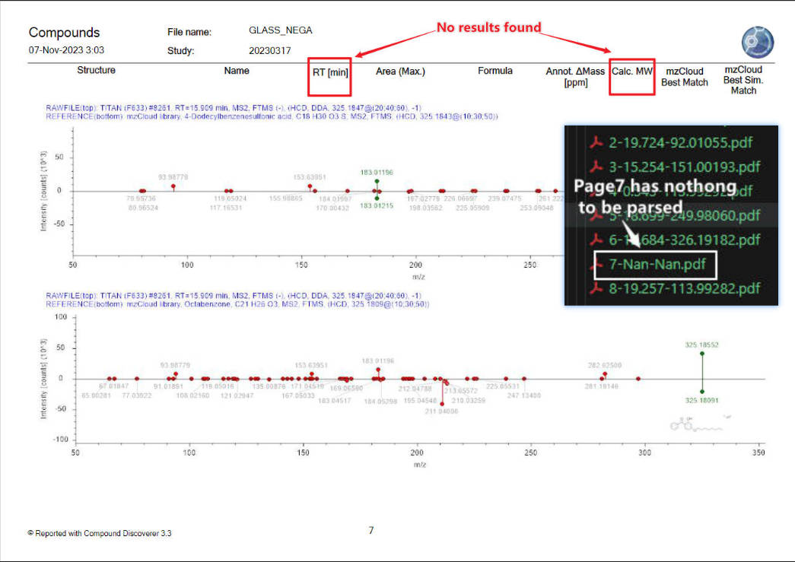

# PDF SPLITOR

Python implementation of spliting pdfs

**Requirements:**
- python >= 3.8
- fitz

<details open>
<summary>Install</summary>

Clone repo and install [requirements.txt](https://github.com/sjtu-jhw/split_pdfs/blob/main/requirements.txt) in a
[**Python>=3.8.0**](https://www.python.org/) environment, including
[**fitz>=0.0.1**](https://pymupdf.readthedocs.io/en/latest/installation.html).

```bash
git clone https://github.com/sjtu-jhw/split_pdfs.git  # clone
cd split_pdfs
pip install -r requirements.txt  # install
```

</details>

<details open>
<summary>Usage</summary>

Just need to specify the input PDF path and the path where you are prepared to save the split results.

For instance, if the PDF is located in the root directory with the name **Template.pdf**, and you want to save the split results in a folder named **splits** also in root, you can simply run a one-liner in the terminal to obtain your split results.

```
python split.py --pdf_path "./Template.pdf" --output_dir "./splits/"
```

</details>


<details open>
<summary>Results</summary>

In the **splits** folder, you will find a series of PDFs, each representing one page of the original PDF. The naming format is {page_number}-{RL[min]}-{Calc.MW}. If no results are parsed, the corresponding value is NaN.

<p align="center"></p>

</details>